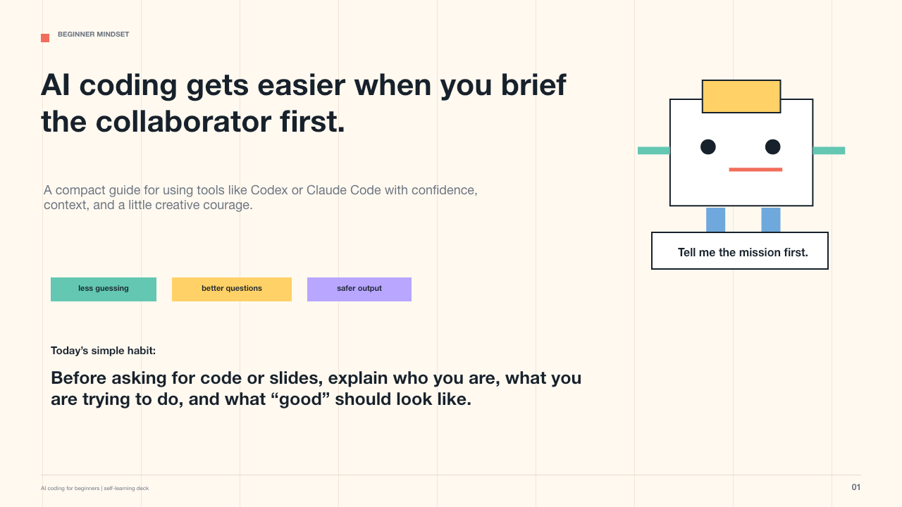
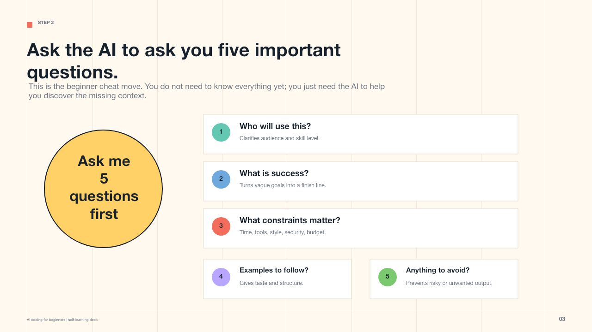
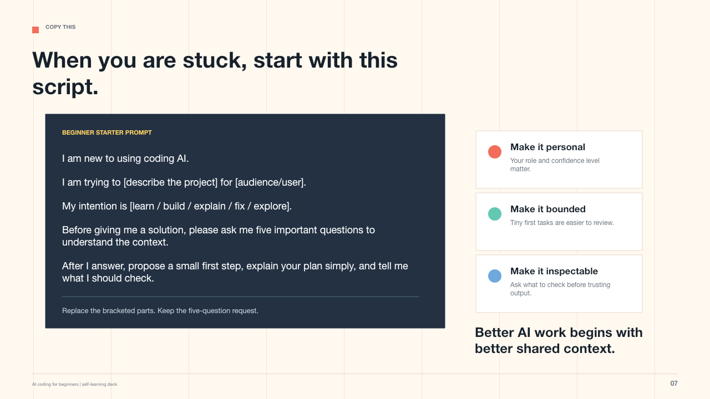
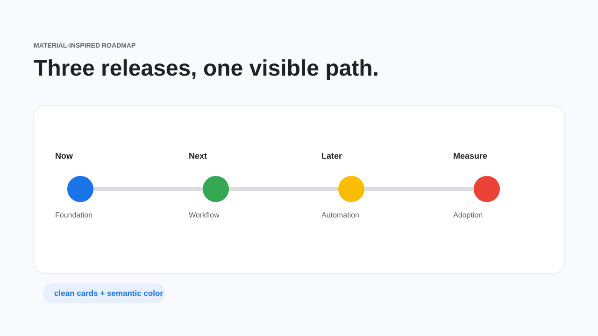
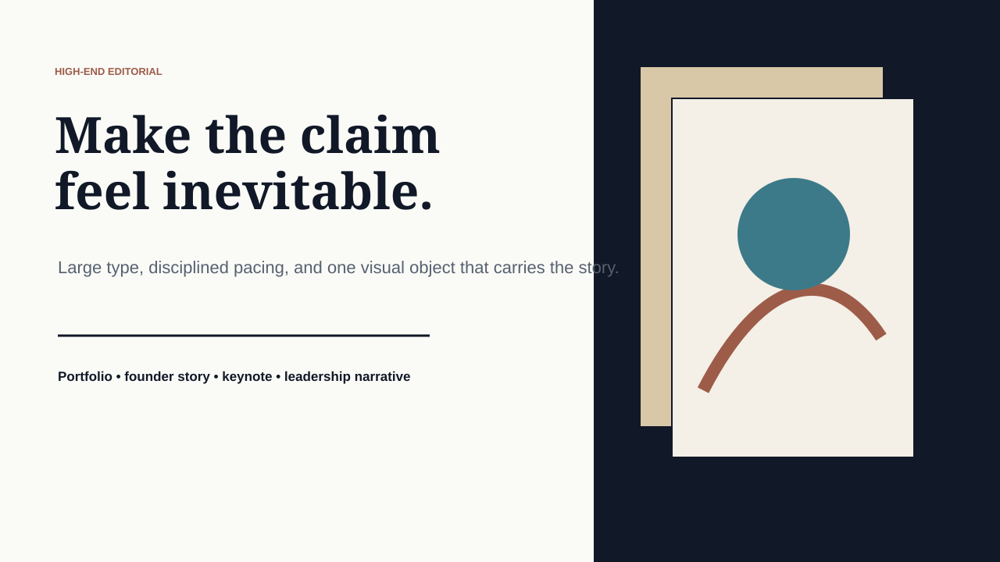
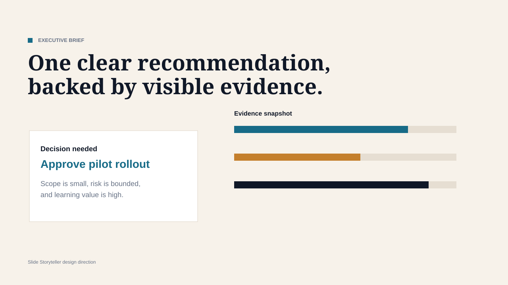
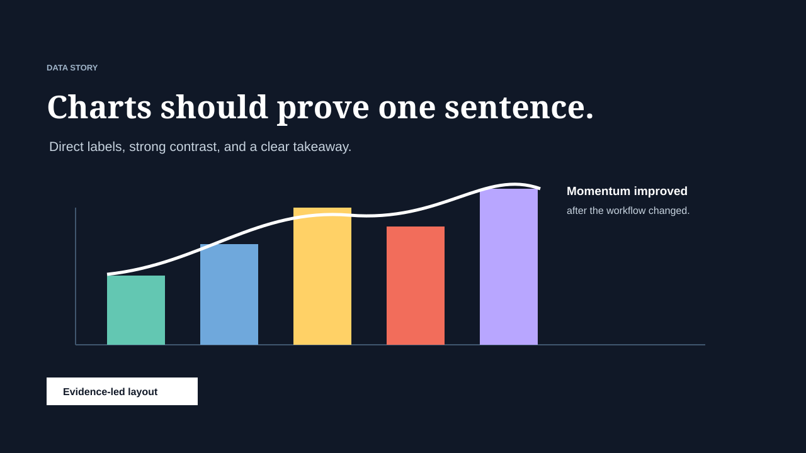

# QuickSlide Skills

A small suite of AI **skills** that turn rough notes into polished presentations — without stopping at an outline or a script.

The repo ships two complementary skills for [Codex](https://openai.com/codex/) and [Claude](https://claude.ai/code):

| Skill | What it makes | Best for |
|---|---|---|
| **[`slide-storyteller`](slide-storyteller/)** | Story-first HTML pages, and real editable PowerPoint (`.pptx`) | Resumes, portfolios, leadership narratives, updates someone reads on their own time, decks you'll keep editing in PowerPoint |
| **[`slide-show`](slide-show/)** | A single self-contained HTML file that opens as a **fullscreen presentation** | Presenting live in the browser — a deck that *plays* with arrow keys, swipe, and a progress bar |

Both are pure instruction skills (Markdown + small references). They require no build step and no runtime beyond your AI agent.

---

## Which skill should I use?

- **Presenting live, or want it to look and behave like PowerPoint/Keynote in a browser?** → `slide-show`. One file, opens fullscreen, navigate with `←` / `→`, space, or swipe.
- **Sharing something people read on their own — a portfolio, resume, or written update?** → `slide-storyteller` (HTML story page).
- **Need an editable `.pptx` to drop into a company template?** → `slide-storyteller` (PowerPoint mode).

They're designed to hand off to each other: `slide-show` points users to `slide-storyteller` when they ask for PowerPoint, and vice-versa.

---

## Install

Both skills work in **Codex** and **Claude Code**. Clone or download this repo, then copy the skill folders into your agent's skills directory.

### Codex

```bash
mkdir -p ~/.codex/skills
cp -R slide-storyteller slide-show ~/.codex/skills/
```

Restart Codex or start a new session, then call a skill by name:

```text
Use $slide-show to build a fullscreen HTML deck from my notes. Ask me for my brand colors first.
```

### Claude Code

```bash
mkdir -p ~/.claude/skills
cp -R slide-storyteller slide-show ~/.claude/skills/
```

The skill triggers automatically when your request matches it — just describe what you want:

```text
Build me a fullscreen HTML presentation from these notes that I can present in the browser.
```

> **Tip:** keep each skill's `description` accurate — on Claude that text is what decides when the skill activates.

---

## `slide-show` — fullscreen HTML decks

Builds **one self-contained `.html` file** that behaves like a real presentation:

- one slide per screen; advance with `←` / `→`, space, `Home`/`End`, on-screen arrows, click zones, or touch swipe
- a slide counter, a progress bar, and `F` to toggle true browser fullscreen
- a **fixed-stage** layout (designed at 1280×720, scaled to any screen) so slides keep their alignment everywhere
- everything inlined — CSS, JS, and SVG — so it works offline as a single shareable file

It **asks for your brand colors up front** and deliberately varies the visual theme each time instead of defaulting to one look. For executive/strategy decks it can follow consulting-style discipline (pyramid structure, action titles, one message per slide).

**Try the examples** (open in a browser):

- [Fullscreen deck — dark theme](examples/slide-show/fullscreen-deck-dark.html)
- [Fullscreen deck — light theme](examples/slide-show/fullscreen-deck-light.html)

## `slide-storyteller` — story pages & PowerPoint

Pushes the agent through a more useful workflow than "here's an outline":

- understand the audience and goal
- write slide *claims* instead of topic labels
- choose a visual system and varied slide formats
- build a polished HTML story by default, or export a real `.pptx` when asked
- verify the artifact before handing it back

**Examples:**

- [Monthly AI Skills Update (HTML)](examples/monthly-ai-skills-update/index.html) — HTML-first story page
- [AI Coding for Beginners (PPTX)](examples/ai-coding-for-beginners/ai-coding-for-beginners.pptx) — a real generated PowerPoint

| Cover | Lesson Framework | Worked Example |
|---|---|---|
|  |  |  |

### Design intelligence

`slide-storyteller` separates each slide into two decisions — the **visual system** and the **slide format** — so the agent picks whether a slide needs a timeline, journey map, comic panel, annotated chart, decision matrix, or case-study proof object before making it pretty.

Supported visual directions include modern executive, high-end editorial, Google/Material product decks, comic storyboard, data newsroom, and roadmap/timeline-heavy styles. Full guidance lives in [`design-systems-and-formats.md`](slide-storyteller/references/design-systems-and-formats.md).

| Material Roadmap | High-End Editorial | Executive Brief | Data Story |
|---|---|---|---|
|  |  |  |  |

See the full visual gallery at [`showcase/index.html`](showcase/index.html).

---

## More example prompts

```text
Use $slide-show to turn this product roadmap into a fullscreen deck I can present on a big screen. Our colors are navy, white, and a coral accent.
```

```text
Use $slide-storyteller to create a resume portfolio page from my experience. Make it polished and warm, with two case-study sections.
```

```text
Use $slide-storyteller to turn these weekly notes into a short PowerPoint update for my manager. Keep it clear, honest, and decision-oriented.
```

---

## Repository structure

```
slide-storyteller/      Story-first HTML + PPTX skill
  SKILL.md              Main instructions
  references/           Deck patterns, design systems, art direction, 1-on-1 guidance
  agents/openai.yaml    Codex UI metadata
slide-show/             Fullscreen HTML deck skill
  SKILL.md              Main instructions
  references/           Deck scaffold, themes & color, consulting-style discipline
  agents/openai.yaml    Codex UI metadata
examples/               Sample outputs (HTML, PPTX, slide-show demos)
showcase/               Visual style gallery
CLAUDE.md               Guidance for AI agents working in this repo
```

---

## Requirements

- An AI coding agent that supports skills (**Codex** or **Claude Code**).
- For `.pptx` export with `slide-storyteller`, a presentation runtime such as `pptxgenjs` or your agent's presentation tooling.
- `slide-show` has **no dependencies** — its output is a plain HTML file that opens in any browser.

---

## Project status

An early but useful prototype. Good current uses: live presentations, team learning decks, weekly/monthly updates, resume and portfolio stories.

**Roadmap:**

- more finished example decks per archetype (pitch, board update, training)
- curated, brand-ready theme packs
- a brand-kit intake (logo + colors + font → consistent palette)
- richer before/after examples and a short walkthrough

Contributions and feedback are welcome — open an issue or a pull request.

## License

MIT. See [LICENSE](LICENSE).
