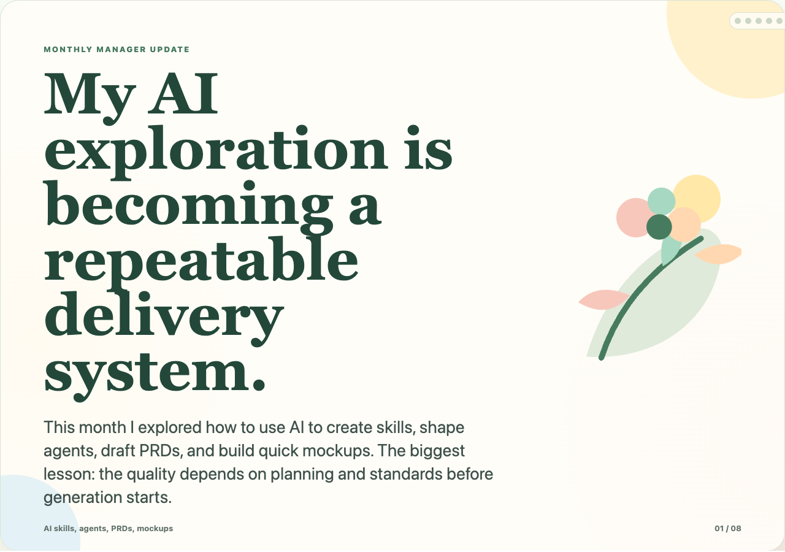
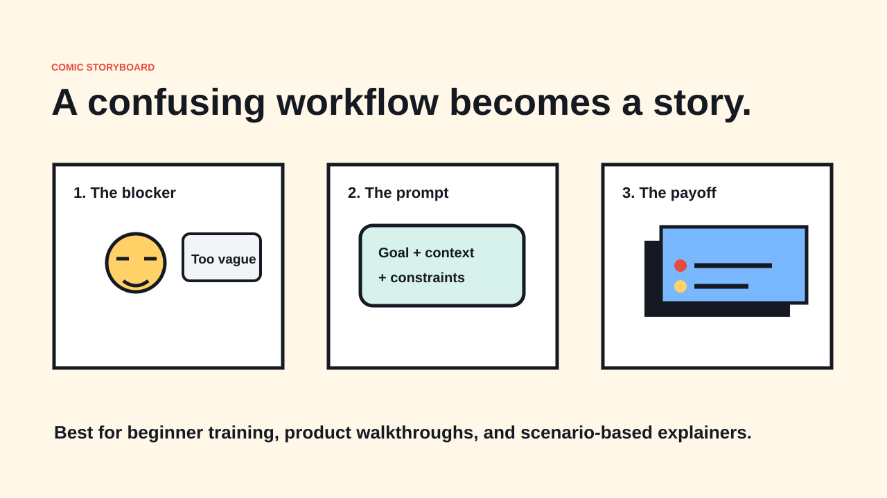
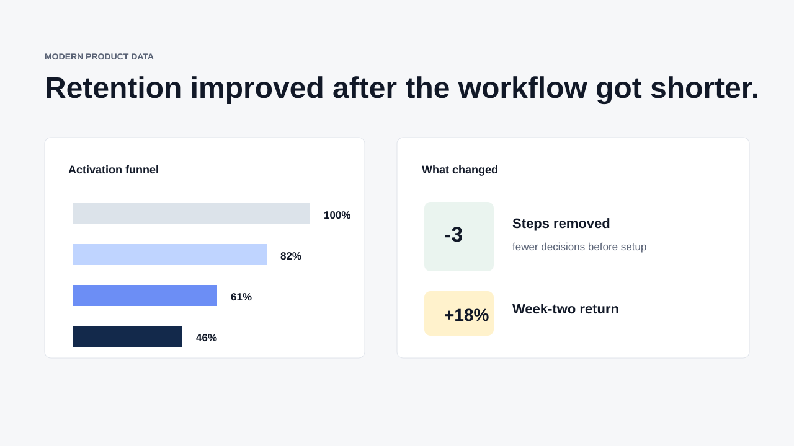
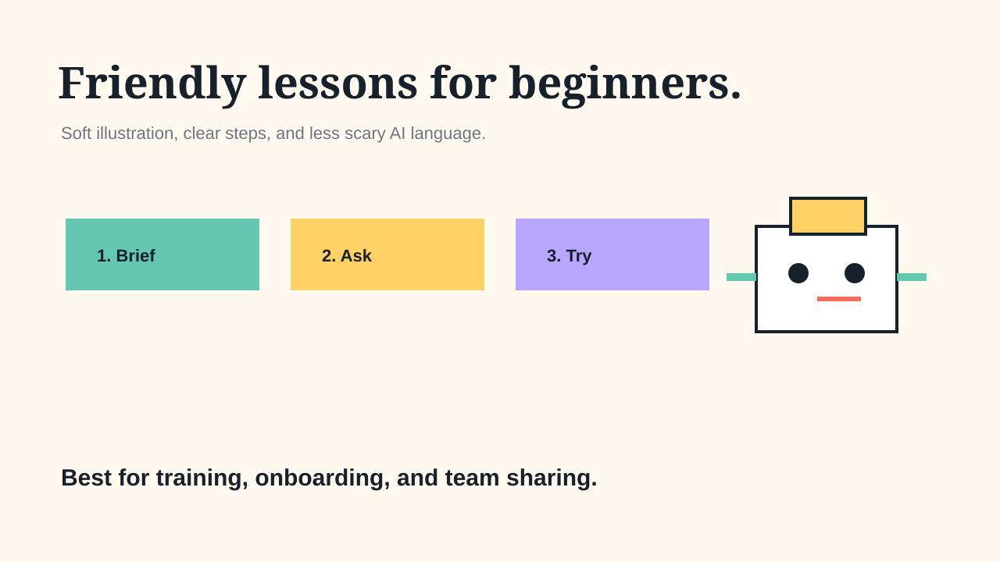
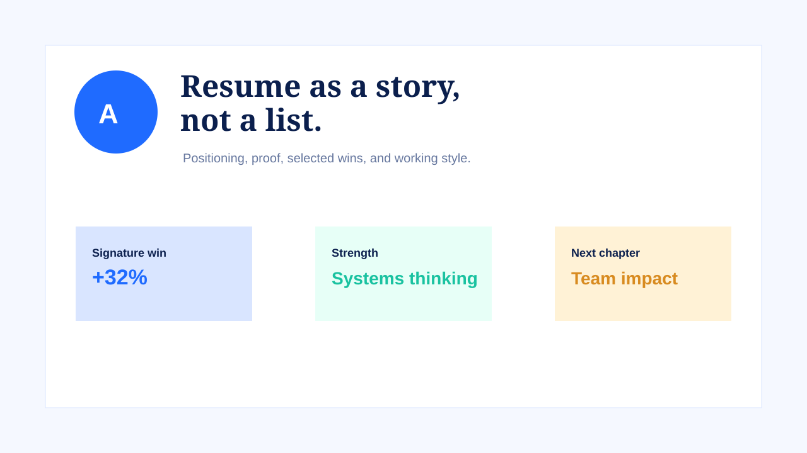
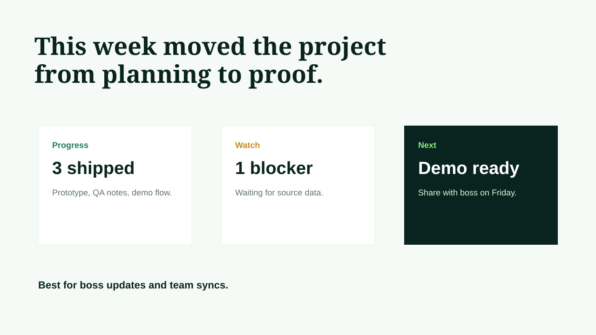
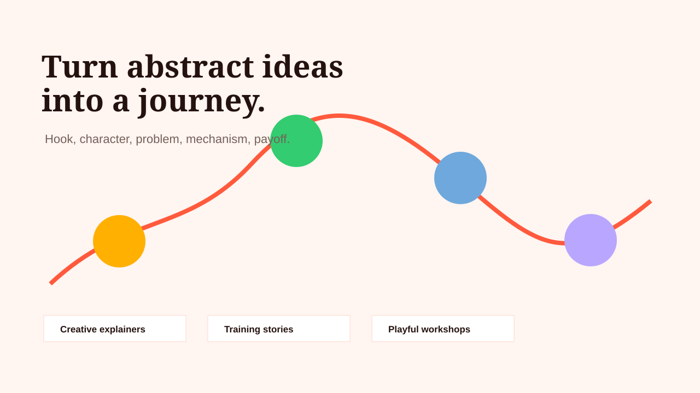

# Slide Storyteller

`slide-storyteller` is a Codex skill for creating polished HTML presentation drafts and editable slide decks for work updates, beginner training, resumes, portfolio stories, leadership narratives, and playful visual explainers.

It is designed for people who want the final output, not a conversion chore. For broad storytelling and portfolio requests, the skill now defaults to a real HTML artifact first. When you explicitly ask for PowerPoint, it tells Codex to produce a real `.pptx`, verify it, and give you the file path first.

## Why This Exists

Most AI slide attempts stop at an outline, a script, or a rough mockup. This skill pushes Codex toward a more useful workflow:

- understand the audience and goal
- write slide claims instead of topic labels
- choose a visual system
- build polished HTML presentation drafts by default
- export an actual PowerPoint file when requested
- verify the artifact before handing it back

## Install

Clone or download this repository, then copy the skill folder into your Codex skills directory:

```bash
mkdir -p ~/.codex/skills
cp -R slide-storyteller ~/.codex/skills/
```

Restart Codex or start a new session, then ask for the skill by name:

```text
Use $slide-storyteller to create a 7-slide beginner training deck about using Codex and Claude Code well. Make it friendly, practical, and shareable with my team.
```

## Requirements

This skill works best in Codex with access to the Presentations plugin/runtime. The skill can help with structure and story anywhere, but actual `.pptx` export depends on presentation tooling being available in the Codex environment.

## Sample Deck Output

### HTML-first monthly update

This HTML example shows the skill's newer default behavior: build a polished presentation draft first, then continue to PowerPoint only if requested.

- [Monthly AI Skills Update HTML](examples/monthly-ai-skills-update/index.html)



### PowerPoint example

A real generated deck is included to show that the skill can produce an actual PowerPoint file, not just an outline:

- [AI Coding for Beginners PPTX](examples/ai-coding-for-beginners/ai-coding-for-beginners.pptx)

These previews are sample slide content from that beginner training deck. They are not the design format library.

| Cover Slide | Lesson Framework | Worked Example |
|---|---|---|
|  |  |  |

## Design Intelligence

The skill now separates slide design into two decisions: the visual system and the slide format. That means Codex should choose whether a slide needs a timeline, journey map, comic panel, annotated chart, decision matrix, roadmap, process flow, or case-study proof object before making it pretty.

Supported visual directions include:

- modern executive and high-end editorial
- Google/Material-inspired product and training decks
- comic storyboard and cute professional explainers
- data newsroom and analytics readouts
- graphic poster, workshop canvas, roadmap, and timeline-heavy decks

The design and source guidance lives in [design-systems-and-formats.md](slide-storyteller/references/design-systems-and-formats.md).

These lightweight previews show the kinds of deck styles the skill is meant to guide.

| Material Roadmap | Comic Storyboard |
|---|---|
|  |  |

| High-End Editorial | Modern Data Product |
|---|---|
|  |  |

| Executive Brief | Cute Learning |
|---|---|
|  |  |

| Data Story | Resume Portfolio |
|---|---|
|  |  |

| Weekly Update | Storybook Explainer |
|---|---|
|  |  |

You can also open the visual gallery at [showcase/index.html](showcase/index.html).

## More Example Prompts

```text
Use $slide-storyteller to turn these weekly notes into a short update deck for my boss. Keep it clear, honest, and decision-oriented.
```

```text
Use $slide-storyteller to create a resume portfolio deck from my experience. Make it polished and warm, with 2 case-study slides.
```

```text
Use $slide-storyteller to create a playful onboarding deck that teaches non-technical teammates how to brief an AI coding agent.
```

## Skill Contents

- [slide-storyteller/SKILL.md](slide-storyteller/SKILL.md): main Codex instructions
- [deck-patterns.md](slide-storyteller/references/deck-patterns.md): reusable deck structures
- [art-direction.md](slide-storyteller/references/art-direction.md): guidance for cute but professional art
- [design-systems-and-formats.md](slide-storyteller/references/design-systems-and-formats.md): professional design systems, slide formats, and free-source guidance
- [showcase/index.html](showcase/index.html): design gallery

## Project Status

This is an early prototype, but it is useful enough to share.

Good current uses:

- personal slide experiments
- team learning decks
- weekly updates
- resume or portfolio story drafts
- beginner-friendly Codex skill examples

Not yet perfect:

- It has one bundled example deck, not a full template library.
- Results depend on the local Codex presentation runtime.
- Brand-specific decks still need user-provided brand assets and source material.

## Recommended Next Improvements

- Add more real `.pptx` examples.
- Add richer before/after examples for modern, comic, Google/Material, and executive decks.
- Add a short video or GIF walkthrough.
- Add a troubleshooting section for environments without PPTX export.
- Add optional company brand template examples.

## License

MIT. See [LICENSE](LICENSE).
